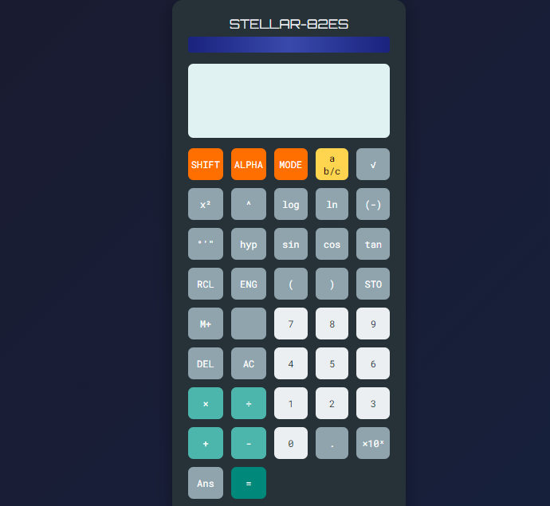

# STELLAR-82ES: Advanced Scientific Calculator

## Overview

STELLAR-82ES is a web-based advanced scientific calculator that mimics the functionality and design of high-end scientific calculators. It provides a user-friendly interface with a wide range of mathematical operations, making it suitable for students, professionals, and anyone in need of complex calculations.

## Features

- Basic arithmetic operations (addition, subtraction, multiplication, division)
- Advanced mathematical functions (square root, exponents, logarithms)
- Trigonometric functions (sine, cosine, tangent)
- Memory functions (store, recall, memory addition)
- Responsive design that works on various screen sizes
- Keyboard support for quick input
- Visual feedback for button presses
- Error handling for invalid operations
- Sleek, modern UI inspired by scientific calculators

## Technologies Used

- HTML5
- CSS3
- JavaScript (ES6+)

## External Resources

- Google Fonts: [Orbitron](https://fonts.google.com/specimen/Orbitron) and [Roboto Mono](https://fonts.google.com/specimen/Roboto+Mono) for typography
- Google Material Icons: Used for the favicon

## Setup and Usage

1. Clone the repository: [Repository](https://github.com/Chowdaa/Calculator.git)
2. Navigate to the project directory
3. Open `index.html` in your preferred web browser.

## Deployment on Netlify

To deploy this project on Netlify, follow these steps:

1. Sign up for a [Netlify account](https://app.netlify.com/signup) if you don't have one.
2. Click on the "New site from Git" button on your Netlify dashboard.
3. Choose GitHub as your git provider and authorize Netlify to access your repositories.
4. Select the repository containing the STELLAR-82ES calculator project.
5. Configure your build settings:
- Build command: Leave blank (not required for static sites)
- Publish directory: Leave blank (Netlify will automatically detect the root directory)
6. Click "Deploy site".
7. Wait for the deployment to complete. Netlify will provide you with a unique URL for your live site.
8. (Optional) Set up a custom domain by going to "Domain settings" in your Netlify site dashboard.

## Contributing

Contributions, issues, and feature requests are welcome! Feel free to check the [issues page](https://github.com/Chowdaa/calculator/issues) if you want to contribute.

## Acknowledgements

- Inspiration drawn from classic scientific calculators like the Casio fx-991ES
- Thanks to Google for providing Material Design Icons and Fonts

